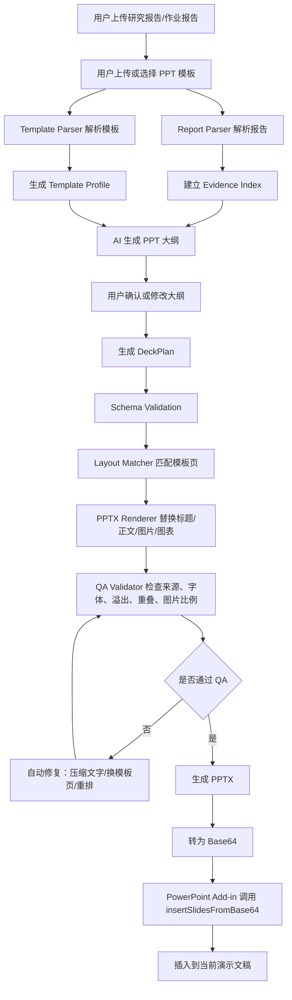
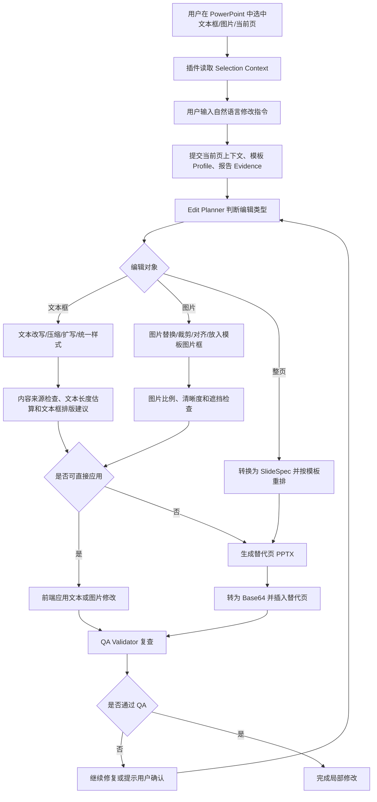

# AI PowerPoint 插件构建路线

## 1. 产品定位

本项目要构建的是一个运行在 PowerPoint 内的 AI 辅助 PPT 制作插件。它不是单纯让 agent 临时生成一份 PPT，而是把报告理解、模板解析、页面规划、模板复用、局部编辑、排版修复和质量检查做成一套可控的插件系统。

插件应支持两类核心工作流：

- **完整生成**：用户上传研究报告、作业报告、论文、项目材料和模板 PPT，插件自动生成结构清晰、风格贴合模板的完整演示文稿。
- **局部修改**：用户在已有 PPT 中选中文本框、图片或整页后，用自然语言要求 agent 修改文字、替换图片、调整图片格式、统一字体、重排当前页或按模板优化页面。

关键原则：

- 内容必须以上传报告、用户补充材料和用户明确输入为准，不能虚构。
- 生成或修改后的内容需要保留来源证据。
- PPT 风格应继承用户模板，包括字体、字号、颜色、目录页、章节页、正文页、图文页、图表页、页脚和装饰元素。
- 如果模板页中已有图片框，应优先替换该图片框，而不是重新摆放图片。
- 如果模板页没有合适图片框，才由排版引擎新增图片并计算安全位置。
- 全 PPT 的标题、正文、注释、图表标签应保持层级和样式一致。

当前第一批测试模板：

- `清华大学2025年度演示文稿系列模板2-通用主题.pptx`
- 初步检查：29 个示例页、401 个 slide layout、8 个 slide master、52 个媒体资源。

该模板应作为第一阶段模板解析、页面角色识别、图片替换和排版复用的主要验证对象。

## 2. 总体架构

推荐采用 **PowerPoint Office Add-in + 后端 API + Python Worker + PPTX 模板/渲染引擎**。

API key 管理原则：

- 用户的 AI API key 只允许放在本地 `backend/.env`。
- GitHub 只提交 `backend/.env.example`，不能提交真实 `.env`。
- 前端永远不直接调用 AI 服务，也不接触 API key。
- 前端只调用本地后端 `/api/...`，由后端在未来的 AI 编排阶段读取环境变量并调用模型服务。
- 后端可通过 `GET /api/settings/ai` 暴露非敏感状态，例如是否已配置、模型名和 API host，但不能返回完整 key。

```text
PowerPoint Add-in
  |
  | 上传报告、模板、当前页上下文、用户自然语言指令
  v
API Service
  |
  +-- Report Parser
  +-- Template Parser
  +-- Evidence Index
  +-- AI Orchestrator
  +-- Deck Planner
  +-- Edit Planner
  +-- Layout Matcher
  +-- PPTX Renderer
  +-- QA Validator
  |
  v
Generated or Edited PPTX
  |
  | Base64
  v
PowerPoint 插入、替换或局部更新
```

## 3. 两条核心工作流

### 3.1 完整生成工作流



### 3.2 局部修改工作流



### 3.3 两条工作流的关系

完整生成工作流负责从报告和模板创建一套 PPT。局部修改工作流负责在已有 PPT 上继续编辑和优化。

两者共用：

- Report Parser。
- Template Parser。
- Evidence Index。
- Style Tokens。
- Layout Matcher。
- PPTX Renderer。
- QA Validator。

差异在于：

- 完整生成以 `DeckPlan` 为核心。
- 单页重排以 `SlideSpec` 为核心。
- 选中对象修改以 `EditPlan` 和 `Selection Context` 为核心。

文本框局部编辑需要同时处理内容和排版。当前实现要求文本改写接口返回 `layoutSuggestion`，包括替换前后文字长度估算、建议文本框下移量、建议高度缩放、建议字号缩放，以及是否应改用当前页重排。前端先展示建议，应用文字替换后会通过 PowerPoint selected shape API 尝试移动、增高和缩小当前选中文本框；如果选区不支持 shape 调整，则提示用户手动调整或通过“当前页重排生成替代页”完成。

## 4. PowerPoint 插件层

### 4.1 技术选择

插件前端建议使用：

- Office.js
- React
- TypeScript
- Fluent UI 或轻量自定义 UI

Office Add-ins 是微软官方 Office 插件体系。PowerPoint Add-in 以网页形式运行在 PowerPoint 任务窗格中，可以通过 Office.js 与当前演示文稿交互。

前端插件负责：

- 上传报告和模板。
- 展示生成大纲。
- 展示模板页候选。
- 展示生成进度。
- 插入后端生成的 PPTX。
- 读取当前选中的文本框、图片或当前页上下文。
- 将用户的自然语言修改指令发送给后端。
- 接收后端返回的修改结果并应用到 PowerPoint。

### 4.2 插入完整 PPT 的方式

完整生成 PPT 时，推荐由后端生成 PPTX，再转成 Base64 返回前端。前端调用 PowerPoint API 的 `insertSlidesFromBase64` 将生成结果插入当前演示文稿。

前端示例：

```ts
const response = await fetch("/api/decks/generate", {
  method: "POST",
  body: formData
});

const result = await response.json();

await PowerPoint.run(async (context) => {
  context.presentation.insertSlidesFromBase64(result.pptxBase64, {
    formatting: PowerPoint.InsertSlideFormatting.keepSourceFormatting
  });
  await context.sync();
});
```

`keepSourceFormatting` 应作为默认策略，因为用户希望保留模板 PPT 的视觉风格。

### 4.3 局部编辑的前端交互

插件任务窗格需要提供“选中对象编辑”模式。

典型交互：

1. 用户在 PowerPoint 中点击某个文本框、图片或当前页。
2. 插件读取当前 selection 或当前 slide 的上下文。
3. 插件显示“当前选中：文本框 / 图片 / 整页”。
4. 用户输入自然语言指令，例如：
   - “把这个标题改得更学术一点，但不要改变意思。”
   - “把这段文字缩短到三条要点。”
   - “这张图太大了，改成右侧配图，左侧放三条说明。”
   - “这一页太拥挤，按模板重新排版。”
   - “统一这一页的标题和正文样式。”
   - “把图片改成圆角并和模板中的图片比例一致。”
5. 前端把 selection context、当前页上下文、报告 evidence、模板 profile 和用户指令发送到后端。
6. 后端返回修改方案和可应用结果。
7. 前端应用修改，或插入一页修改后的替代 slide。

## 5. 后端服务层

### 5.1 API Service

建议使用 Node.js + Fastify 或 NestJS。

核心接口：

```text
POST /api/templates/analyze
POST /api/reports/parse
POST /api/decks/plan
POST /api/decks/generate
POST /api/edits/selection
POST /api/edits/slide
GET  /api/jobs/:jobId
GET  /api/decks/:deckId/base64
```

接口职责：

- 管理文件上传。
- 创建异步任务。
- 保存报告解析结果。
- 保存模板 profile。
- 调用 AI 编排模块。
- 调用 Python Worker 生成或修改 PPTX。
- 返回 Base64、QA 报告和修改摘要。

### 5.2 Python Worker

建议使用 Python 处理 PPTX、PDF、DOCX、图片和 QA。

可用库：

- `python-pptx`
- `lxml`
- `Pillow`
- `PyMuPDF`
- `python-docx`
- `pandas`
- `matplotlib`

核心任务：

- 解析 PPTX zip 和 Open XML。
- 识别 slide、layout、master、media relationship。
- 提取文本框、图片框、图表框、占位符和 bbox。
- 替换模板页中的文本和图片。
- 新增图片或图表并计算安全位置。
- 渲染缩略图或 PDF 进行视觉 QA。
- 输出可插入的 PPTX。

## 6. 模板解析系统

模板解析不是只提取主题色，而是要把用户模板拆成可复用的页面库。

上传模板 PPTX 后，系统应解析：

- slide master。
- slide layout。
- 每个示例页。
- 文本框位置、字体、字号、颜色、层级。
- 图片框位置、尺寸、裁剪、层级。
- 图表、表格和占位符。
- 背景、装饰线、校徽、页脚、页码。
- 每页的页面角色。

模板 profile 示例：

```json
{
  "templateId": "tsinghua-2025-general-2",
  "slides": 29,
  "masters": 8,
  "layouts": 401,
  "media": 52,
  "roles": [
    "cover",
    "agenda",
    "section_divider",
    "content_text",
    "content_image",
    "content_chart",
    "comparison",
    "summary",
    "closing"
  ]
}
```

页面角色识别规则：

- 封面页：标题、副标题、作者、单位、日期。
- 目录页：章节列表和编号。
- 章节页：章节编号、章节标题、过渡说明。
- 正文页：标题、段落、要点。
- 图文页：标题、正文、图片框。
- 图表页：标题、图表区域、数据说明。
- 对比页：左右结构、优劣对比、方案对比。
- 总结页：结论、贡献、下一步。
- 结尾页：致谢、联系方式、结束语。

模板解析结果需要保存为：

```text
templates/
  tsinghua-2025-general-2/
    source.pptx
    template-profile.json
    thumbnails/
    extracted-media/
```

## 7. 报告解析和证据索引

报告解析系统负责把用户上传的 PDF、DOCX、Markdown 或文本材料转成可追踪内容。

需要提取：

- 标题层级。
- 段落。
- 表格。
- 图片。
- 图注。
- 数据。
- 引用。
- 结论性语句。

每个内容块都应建立 evidence id：

```json
{
  "id": "report:p12:para3",
  "type": "paragraph",
  "page": 12,
  "text": "原始报告中的段落文本..."
}
```

生成和修改 PPT 时，所有事实性内容都必须绑定 evidence id。没有来源的内容不能进入最终 PPT。

## 8. 中间层设计

中间层用于连接 AI 理解和 PPT 渲染。AI 负责理解、归纳、规划和提出编辑意图；渲染引擎负责根据模板和规则真正生成 PPT。

### 8.1 DeckPlan

完整生成时使用 `DeckPlan`。

```json
{
  "title": "研究报告汇报",
  "audience": "课程汇报",
  "templateId": "tsinghua-2025-general-2",
  "slides": [
    {
      "slideId": "s01",
      "role": "cover",
      "title": "研究报告汇报",
      "sourceEvidenceIds": []
    },
    {
      "slideId": "s05",
      "role": "content_image",
      "title": "方法框架",
      "body": ["要点 1", "要点 2"],
      "visual": {
        "kind": "image",
        "sourceEvidenceId": "report:p8:fig1"
      },
      "templateIntent": {
        "preferredRole": "content_image",
        "replaceImageIfExists": true
      }
    }
  ]
}
```

### 8.2 SlideSpec

单页生成或单页重排时使用 `SlideSpec`。

```json
{
  "slideRole": "content_image",
  "title": "实验结果分析",
  "body": ["结果 1", "结果 2", "结果 3"],
  "visuals": [
    {
      "kind": "chart",
      "sourceEvidenceId": "report:p13:table1"
    }
  ],
  "stylePolicy": "inherit_template",
  "layoutPolicy": "reuse_template_page"
}
```

### 8.3 EditPlan

局部编辑时使用 `EditPlan`。

```json
{
  "editType": "selected_text_rewrite",
  "target": {
    "slideId": "current",
    "shapeId": "shape_12",
    "shapeType": "text"
  },
  "instruction": "把这段文字缩短成三条要点",
  "constraints": {
    "preserveMeaning": true,
    "noFabrication": true,
    "inheritStyle": true,
    "fitOriginalBox": true
  },
  "sourceEvidenceIds": ["report:p5:para2", "report:p5:para3"],
  "output": {
    "replacementText": ["要点 1", "要点 2", "要点 3"]
  }
}
```

## 9. 完整 PPT 生成流程

完整生成流程：

1. 用户上传报告和模板 PPT。
2. 系统解析报告，建立 evidence index。
3. 系统解析模板，建立 template profile。
4. AI 根据报告生成大纲。
5. 用户确认或修改大纲。
6. AI 生成 DeckPlan。
7. DeckPlan 通过 schema validation。
8. Layout Matcher 为每页选择模板页。
9. PPTX Renderer 替换模板页中的标题、正文、图片和图表。
10. QA Validator 检查内容来源、字体一致性、溢出、重叠和图片比例。
11. 未通过的页面自动修复或换模板页。
12. 后端返回 PPTX Base64。
13. 插件插入 PowerPoint。

## 10. 局部编辑功能实现

局部编辑是插件的重要能力。它解决的是：用户已经有一份 PPT，但对某个文本框、图片或整页排版不满意，希望在 PowerPoint 内直接让 agent 修改。

### 10.1 支持的编辑对象

第一版应支持三类对象：

- **选中文本框**：改写、缩短、扩写、学术化、口语化、转为要点、统一字体、修复溢出。
- **选中图片**：替换图片、调整大小、裁剪比例、圆角、居中、对齐、放入模板图片框、移动到合适区域。
- **当前整页**：重新排版、按模板重排、拆分为两页、转换为图文页、统一字体层级、减少拥挤感。

### 10.2 Selection Context

前端需要读取并上传当前选中对象的上下文。由于 PowerPoint Office.js 对 shape 级能力存在边界，第一版可以采用两种策略并行：

- 能通过 Office.js 读取的内容，直接读取 selection、文本和基本属性。
- 对 Office.js 难以精细读取的内容，将当前演示文稿或当前页导出/上传给后端，由后端解析 PPTX XML 获取 shape 信息。

Selection Context 示例：

```json
{
  "selectionType": "text",
  "slideIndex": 5,
  "shapeId": "shape_12",
  "text": "当前文本框内容",
  "bbox": { "x": 1.2, "y": 1.5, "w": 6.8, "h": 1.4 },
  "style": {
    "fontFamily": "Microsoft YaHei",
    "fontSize": 18,
    "color": "#000000"
  },
  "nearbyShapes": [
    { "shapeId": "shape_13", "type": "image", "bbox": { "x": 7.2, "y": 1.4, "w": 3.2, "h": 2.4 } }
  ]
}
```

### 10.3 文本框编辑流程

适用指令：

- “把这段话缩短到三条要点。”
- “让这个标题更正式。”
- “保持原意，改成答辩 PPT 风格。”
- “这段文字太长，压缩到能放进原文本框。”

流程：

1. 前端读取选中文本框内容和样式。
2. 后端根据报告 evidence 判断文本来源。
3. AI 生成候选改写。
4. QA 检查是否新增无来源事实。
5. Layout Engine 检查是否能放入原文本框。
6. 如果放不下，则继续压缩或建议改为两页。
7. 前端替换文本，并保留原字体、字号、颜色和项目符号样式。

硬规则：

- 改写不能改变事实含义。
- 不能新增报告中不存在的数据、结论或引用。
- 默认保留原文本框位置和样式。
- 如果用户要求“更美观”，仍需优先继承模板样式。

### 10.4 图片编辑流程

适用指令：

- “把这张图换成报告里的 Figure 2。”
- “让这张图片和模板中的图片框一样大。”
- “把图片放到右侧，左侧保留三条说明。”
- “裁剪成和模板一致的比例。”
- “图片不要变形，居中显示。”

流程：

1. 前端识别选中图片或当前页图片。
2. 后端读取该图片的 bbox、裁剪、层级和周围元素。
3. 如果用户要求替换图片，优先从报告图片、用户上传图片或模板 media 中选择。
4. 如果当前页有模板图片框，优先替换图片框 media relationship。
5. 如果没有图片框，Layout Engine 计算安全区域。
6. QA 检查图片是否变形、是否遮挡文本、是否低清晰度。
7. 前端应用修改，或插入一页修改后的替代 slide。

硬规则：

- 图片不能拉伸变形。
- 不能遮挡标题、页码、校徽、页脚和正文。
- 替换图片必须来自用户材料、报告材料、模板材料或明确允许的来源。
- 如果模板页存在图片框，优先保持原几何属性。

### 10.5 当前页重排流程

适用指令：

- “这一页太乱，按模板重新排版。”
- “把这一页改成图文页。”
- “把这页拆成两页。”
- “统一这一页标题和正文字体。”
- “保留内容，但让版式更像模板正文页。”

流程：

1. 前端提交当前页上下文和用户指令。
2. 后端解析当前页所有 shape。
3. 将当前页内容转换成 `SlideSpec`。
4. 根据内容类型选择模板页或 layout。
5. 保留原内容来源 evidence。
6. 重新渲染当前页为一个替代 slide。
7. QA 检查溢出、重叠、字体一致性和内容来源。
8. 前端插入替代页，并让用户选择保留原页或替换原页。

第一版建议采用“生成替代页并插入到当前页后面”的方式，因为它更稳定，用户也能对比前后效果。后续再实现直接替换当前页。

### 10.6 局部编辑 API

文本框编辑：

```text
POST /api/edits/selection/text
```

请求：

```json
{
  "deckId": "deck_001",
  "slideIndex": 5,
  "selectionContext": {},
  "instruction": "把这段文字缩短成三条要点",
  "reportContextId": "report_001",
  "templateId": "tsinghua-2025-general-2"
}
```

返回：

```json
{
  "editType": "replace_text",
  "replacementText": ["要点 1", "要点 2", "要点 3"],
  "stylePolicy": "preserve_existing",
  "qa": {
    "passed": true,
    "sourceEvidenceIds": ["report:p5:para2"]
  }
}
```

图片编辑：

```text
POST /api/edits/selection/image
```

当前页重排：

```text
POST /api/edits/slide/reflow
```

返回可以是：

- 直接可应用的文本修改。
- 图片替换指令。
- 修改后的单页 PPTX Base64。
- 修改后的完整 PPTX Base64。

## 11. 模板页复用和图片替换策略

当用户指定“按照这个模板生成”时，系统应优先复用模板页，而不是重新设计。

规则：

- 目录内容进入模板目录页。
- 章节标题进入模板章节页。
- 正文内容进入模板正文页。
- 有图片时优先选择模板图文页。
- 有图表时优先选择模板图表页。
- 有对比关系时优先选择对比页。
- 总结内容进入总结页或结尾页。

图片替换规则：

1. 选中的模板页有图片框时，优先替换图片框中的图片。
2. 替换时保留原图片框位置、尺寸、裁剪比例、圆角和阴影。
3. 模板页无图片框但内容需要图片时，优先换用图文模板页。
4. 必须新增图片时，按模板网格计算安全区域。
5. 图片不能遮挡标题、页脚、校徽和正文。
6. 图片来源必须可追踪。

## 12. 质量约束

### 12.1 不允许虚构

所有事实性内容必须来自：

- 上传报告。
- 用户上传的补充材料。
- 用户明确输入。

实现方式：

- 建立 evidence index。
- 每个 slide block 绑定 evidence id。
- 每次生成或修改后做 claim check。
- 对无来源事实打回重写。
- 无法找到来源时提示用户，而不是补写。

### 12.2 字体和字号一致

实现方式：

- 模板解析阶段生成 `style_tokens`。
- 标题、正文、注释、图表标签分别使用对应 token。
- 渲染阶段禁止随意创造字体和字号。
- QA 阶段检查同级标题和正文是否一致。

示例：

```json
{
  "styleTokens": {
    "title": {
      "fontFamily": "Microsoft YaHei",
      "fontSize": 28,
      "fontWeight": 600
    },
    "body": {
      "fontFamily": "Microsoft YaHei",
      "fontSize": 16,
      "lineSpacing": 1.25
    }
  }
}
```

### 12.3 页面 QA

每次生成或修改后检查：

- 文本是否溢出。
- 元素是否重叠。
- 标题是否过长。
- 字体是否不一致。
- 图片是否拉伸变形。
- 图片清晰度是否不足。
- 是否存在无来源事实。
- 目录和章节是否匹配。
- 页码、校徽、页脚是否被遮挡。

失败页面进入自动修复流程。

## 13. 推荐仓库结构

```text
ppt-builders/
  apps/
    powerpoint-addin/
      src/
      public/
      manifest.xml
  services/
    api/
      src/
      package.json
    worker/
      pptx_template_parser/
      report_parser/
      renderer/
      qa/
      pyproject.toml
  packages/
    deck-schema/
    template-schema/
    edit-schema/
    shared-types/
  templates/
    tsinghua-2025-general-2/
      source.pptx
      template-profile.json
      thumbnails/
      extracted-media/
  examples/
    reports/
    generated/
    edited/
  docs/
    architecture.md
    template-parsing.md
    qa-standards.md
    local-editing.md
```

## 14. 推荐开发顺序

混合方案的开发应遵循“先跑通最小闭环，再逐步增强能力”的原则。不要一开始就同时实现 AI 规划、模板解析、局部编辑和质量检查，否则会同时遇到 Office.js、PPTX XML、模板识别、AI 输出校验等多个复杂问题。

推荐按“先让系统能生成一页可控 PPT，再接模板、报告、编辑和 QA”的顺序推进。核心分界线是 `DeckPlan`：它应作为内容理解和 PPT 生成之间的中间层，避免报告解析、模板匹配和渲染逻辑直接耦合。

推荐顺序：

```text
1. 插件前端骨架
2. 后端 API 骨架
3. PPT 读写/生成最小闭环
4. Base64 插入 PPT 闭环
5. 清华模板解析脚本
6. Template Profile
7. 模板页替换生成
8. DeckPlan schema
9. 报告解析和 Evidence Index
10. 文本框局部编辑
11. 图片替换和格式调整
12. 当前页重排生成替代页
13. QA 检查和自动修复
```

第一阶段的最小 MVP 应先完成：

```text
PowerPoint Add-in -> API -> 生成一页测试 PPTX -> Base64 -> 插入 PowerPoint
```

这个闭环完成后，项目就具备可运行的插件原型。随后再逐步接入清华模板解析、Template Profile、DeckPlan、报告证据索引、局部编辑和 QA 检查。

各步骤目标如下：

1. **插件前端骨架**：创建 PowerPoint Add-in 任务窗格，提供上传入口、生成按钮、任务状态、结果摘要和插入动作。
2. **后端 API 骨架**：创建文件上传、生成任务、任务查询和 Base64 返回接口。
3. **PPT 读写/生成最小闭环**：后端先不接模板，只验证能创建、打开、保存一页测试 PPTX。
4. **Base64 插入 PPT 闭环**：后端返回测试 PPTX Base64，前端调用 `insertSlidesFromBase64` 插入当前演示文稿。
5. **清华模板解析脚本**：读取模板 PPTX，提取 slide、layout、master、media 和页面缩略图。
6. **Template Profile**：识别模板页角色、文本框、图片框、字体、字号、颜色和可替换区域。
7. **模板页替换生成**：用 profile 替换固定几类页面的标题、正文和图片，先证明模板可以被稳定填充。
8. **DeckPlan schema**：定义“生成哪些页、每页用什么模板、填哪些内容”的中间层，并做 schema validation。
9. **报告解析和 Evidence Index**：解析 PDF、DOCX、Markdown，为段落、图片和表格建立来源 ID，再从 evidence 生成 DeckPlan。
10. **文本框局部编辑**：选中文本框后，用自然语言改写，并保留原字体和样式。
11. **图片替换和格式调整**：支持图片替换、保持比例、裁剪、居中和复用模板图片框。
12. **当前页重排生成替代页**：将当前页转换为 SlideSpec，按模板生成替代页并插入到当前页后面。
13. **QA 检查和自动修复**：检查文本溢出、元素重叠、字体一致性、图片变形和无来源事实。

## 15. 实施阶段

### 阶段 1：插件闭环

目标：PowerPoint 插件可以调用后端并插入生成 PPT。

第一步先构建前端骨架。前端采用：

- **Office.js**：使用 PowerPoint 官方 Add-in API，负责读取 Office 环境、调用 `insertSlidesFromBase64`、后续读取 selection context。
- **React**：承载任务窗格 UI，适合后续拆分上传区、生成进度、模板候选、局部编辑面板和 QA 报告。
- **TypeScript**：约束前后端数据结构，后续与 `DeckPlan`、`Template Profile`、`EditPlan` schema 共用类型。
- **Vite**：作为本地开发和打包工具，启动快，适合插件任务窗格这种前端单页应用。
- **轻量自定义 UI 起步**：第一步只做稳定任务窗格，不先引入大型 UI 依赖；当控件复杂度上来后，再接 Fluent UI。

前端骨架目录：

```text
frontend/
  manifest.xml
  package.json
  tsconfig.json
  vite.config.ts
  index.html
  src/
    main.tsx
    App.tsx
    office/
      powerpoint.ts
    api/
      decks.ts
    styles.css
```

前端视觉规范：

- 插件任务窗格采用 Apple-inspired utility surface，而不是后台管理系统风格。
- 单一交互色为 Action Blue `#0066cc`，不引入第二品牌色。
- 使用 system / SF Pro 风格字体栈，按钮和主要操作使用 pill 形态。
- 页面背景使用浅灰 `#f5f5f7`，内容面板使用白色和 1px hairline。
- 不使用装饰渐变，不给按钮、文字或普通卡片加阴影。
- 仅保留必要状态信息，UI chrome 后退，让报告、模板、生成状态成为主内容。
- 根据当前工程约束，实际 CSS 不使用负 letter-spacing。

构建流程：

1. 创建 PowerPoint Add-in manifest，声明任务窗格入口和 HTTPS 开发地址。
2. 创建 React 任务窗格，包含报告上传、模板上传、生成按钮、状态区和插入按钮。
3. 封装后端调用：先预留 `/api/decks/generate`，返回 `pptxBase64`、`summary` 和 `qa`。
4. 封装 PowerPoint 插入能力：通过 Office.js 调用 `insertSlidesFromBase64`。
5. 做本地开发命令：`npm run dev` 启动任务窗格，`npm run build` 输出静态资源。
6. 后端未完成前，前端保留清晰的错误状态和 mock 入口，但不把 mock 作为正式闭环验收。

任务：

- 初始化 Office.js PowerPoint Add-in。
- 实现上传报告和模板的任务窗格 UI。
- 实现 `/api/decks/generate`。
- 后端返回测试 PPTX Base64。
- 前端调用 `insertSlidesFromBase64` 插入。

验收：

- PowerPoint 中可以打开插件。
- 插件可以上传文件。
- 可以插入后端返回的 PPTX slide。

当前实现状态：

- 前端任务窗格骨架已完成。
- 后端 API 骨架已完成。
- 后端已能生成一页测试 PPTX 并返回 `pptxBase64`。
- 本地开发服务器使用 Office Add-in dev certificate 提供 HTTPS。

### 阶段 2：清华模板解析

目标：解析模板页、母版、版式、图片和样式。

任务：

- 读取 PPTX zip 结构。
- 提取 slide、layout、master、media。
- 生成每页缩略图。
- 提取文本框、图片框和 bbox。
- 标注封面、目录、章节页、正文页、图文页、图表页、总结页。
- 生成 `template-profile.json`。

验收：

- 能列出 29 个模板示例页。
- 能识别每页图片框和文本框。
- 能保存字体、字号、颜色和页面角色。

当前实现状态：

- 已实现通用 PPTX Open XML 解析模块，不只适用于清华模板。
- 已生成 `templates/tsinghua-2025-general-2/template-profile.json`。
- 清华模板解析结果：29 个示例页、401 个 slide layout、8 个 slide master、52 个媒体资源。
- 已提供 `GET /api/templates/default`、`POST /api/templates/default` 和 `POST /api/templates/analyze`。
- 不上传模板时默认使用清华模板；用户可通过插件按钮保存新的默认模板。

### 阶段 2b：Template Profile

目标：把原始模板解析结果整理成生成阶段可直接使用的能力层。

任务：

- 按页面角色建立 `roleIndex`。
- 生成每类页面的 `recommendedSlides`。
- 识别可替换文本槽位和图片槽位。
- 提取标题、正文、注释等 `styleTokens`。
- 生成每页 `slideSummaries`，供后续模板页匹配和替换使用。

验收：

- Profile 能告诉生成器某类内容优先使用哪些模板页。
- Profile 能告诉生成器哪些 shape 可以替换标题、正文、注释和图片。
- Profile 能提供字体、字号、颜色和主题色板。

当前实现状态：

- `template-profile.json` 已包含 `capabilities.roleIndex`。
- 已生成 `capabilities.recommendedSlides`。
- 已识别 `capabilities.replaceableSlots`，当前清华模板为 256 个槽位。
- 已生成 `capabilities.styleTokens`，包括 title、subtitle、body、caption、palette 和 fonts。
- 已生成 `capabilities.slideSummaries`，供后续第 7 步模板页替换使用。

### 阶段 2c：模板页替换生成

目标：使用 Template Profile 的推荐页面和可替换槽位生成一页模板风格 PPT。

任务：

- 从 `recommendedSlides` 中选择适合的模板页。
- 从 `replaceableSlots` 中选择 title、body 和 image 槽位。
- 将生成标题、正文要点和图片占位写入对应 bbox。
- 使用 `styleTokens` 继承模板字体、字号和颜色。
- 返回 `templateReplacement` 元数据，说明使用了哪一页、替换了哪些槽位。

验收：

- 生成结果不再是普通 smoke test 页面，而是基于模板页槽位布局。
- 不上传模板时使用默认清华模板的 profile。
- 上传新模板时即时分析该模板并使用其 profile 生成。

当前实现状态：

- `/api/decks/generate` 已切换为模板槽位替换渲染。
- 当前清华模板默认选择第 7 页 `content_text` 作为正文页候选。
- 已能替换标题和正文槽位，并返回 `templateReplacement`。
- 当前仍未复制模板页原始背景和装饰，后续需要在真正模板页渲染阶段补齐。

### 阶段 2d：DeckPlan schema

目标：在报告解析/AI 规划和 PPT 渲染之间建立稳定中间层。

任务：

- 定义 `DeckPlan`、`SlideSpec`、`SlideBlock`、`VisualSpec`。
- 使用 schema validation 检查计划结构。
- 将用户指令、报告文件、模板信息转换为单页 DeckPlan。
- 让生成接口先产出 DeckPlan，再由模板渲染器消费 `SlideSpec`。
- 提供只规划不渲染的 `/api/decks/plan` 接口。

验收：

- `/api/decks/plan` 返回 schema valid 的 DeckPlan。
- `/api/decks/generate` 返回 `deckPlan` 和 `templateReplacement`。
- 模板页选择来自 `SlideSpec.templateIntent`，而不是渲染器内部临时决定。

当前实现状态：

- 已新增 Zod 版 `DeckPlan` schema。
- 已实现单页 `buildSingleSlideDeckPlan`。
- 已新增 `/api/decks/plan`。
- `/api/decks/generate` 已先构建 DeckPlan，再渲染第一张 `SlideSpec`。
- 当前 DeckPlan 仍是基于文件名和用户指令的占位规划，尚未接报告正文解析和 evidence index。

### 阶段 3：报告解析和 evidence index

目标：生成和修改内容均可追踪来源。

任务：

- 支持 PDF、DOCX、Markdown。
- 提取章节、段落、表格、图片。
- 为每个内容块建立 evidence id。
- 支持按 evidence 检索相关内容。

验收：

- 每个 slide idea 都有来源。
- 没有来源的事实不能进入最终 PPT。

当前实现状态：

- 已新增当前报告存储：首次上传报告后保存到 `reports/current/`。
- 后续 `/api/decks/plan` 和 `/api/decks/generate` 可以不再上传报告，自动复用当前报告。
- 已实现 DOCX OOXML 解析，读取 `word/document.xml` 中的段落和表格文本。
- 已生成 `evidence-index.json`，包含 evidence id、文本、类型、顺序和关键词。
- DeckPlan 已使用 Evidence Index 选择相关 evidence，并将 `sourceEvidenceIds` 写入 `SlideSpec`。
- 当前 evidence 匹配仍是关键词检索，尚未接 AI 语义检索或引用校验。

### 阶段 4：DeckPlan 和模板页生成

目标：基于报告和模板生成完整 PPT。

任务：

- 定义 DeckPlan、SlideSpec、VisualSpec、TemplateIntent。
- 实现 schema validation。
- 根据 slide role 选择模板页。
- 替换标题、正文、目录项、图片和图表。
- 保留模板背景、装饰、页脚和校徽。

验收：

- 目录内容进入模板目录页。
- 正文内容进入模板正文页。
- 图片优先替换模板原图片位置。
- 生成结果保持清华模板风格。

### 阶段 5：局部编辑 MVP

目标：用户可以选中文本框、图片或当前页，用自然语言要求 agent 修改。

任务：

- 前端识别 selection type。
- 构建 selection context。
- 实现 `/api/edits/selection/text`。
- 实现 `/api/edits/selection/image`。
- 实现 `/api/edits/slide/reflow`。
- 文本修改保留原样式。
- 图片修改优先保留或复用模板图片框。
- 当前页重排先以“插入替代页”方式实现。

验收：

- 选中文本框后可以自然语言改写并替换文本。
- 选中图片后可以调整大小、裁剪、替换或移动。
- 对当前页输入“按模板重排”后，可以生成一页替代 slide。
- 修改后不新增无来源事实。
- 修改后尽量继承模板字体和版式。

### 阶段 6：质量检查和自动修复

目标：减少难看的 PPT 和格式错误。

任务：

- 渲染缩略图。
- 检查文本溢出。
- 检查元素重叠。
- 检查字体一致性。
- 检查图片比例。
- 检查 source evidence。
- 失败页面自动压缩文字、换模板页或重新排版。

验收：

- QA 报告指出每页问题。
- 常见问题可以自动修复。
- 无法修复时给用户明确提示。

### 阶段 7：高级交互

目标：从 PPT 生成器升级为 PowerPoint copilot。

任务：

- 当前页一键优化。
- 一页拆两页。
- 多页统一字体和标题层级。
- 将文字页改成图文页。
- 将图文页改成图表页。
- 按报告补充某页内容。
- 对修改结果提供前后对比。

验收：

- 用户可以在已有 PPT 上连续局部修改。
- 每次修改都保持内容可信和风格一致。

## 16. 第一版优先级

优先实现：

1. PowerPoint Add-in 插入 PPTX 闭环。
2. 清华模板解析。
3. 目录页、章节页、正文页、图文页复用。
4. 报告 evidence index。
5. 不虚构检查。
6. 字体一致性检查。
7. 图片框替换。
8. 文本框自然语言改写。
9. 图片自然语言调整。
10. 当前页按模板重排并插入替代页。

暂缓实现：

- 大规模模板市场。
- 复杂动画。
- 实时多人协作。
- 商业化计费。
- 完全自由风格生成。
- 直接修改任意复杂 shape 的所有属性。

## 17. 关键风险

### 17.1 PowerPoint Office.js 能力边界

Office.js 对复杂 shape 级编辑有边界。第一版应以后端生成 PPTX 或替代页为主，前端只负责读取上下文、应用简单文本修改和插入结果。

### 17.2 PPTX Open XML 操作复杂

`python-pptx` 对 master、layout、media relationship 和复杂形状支持有限。模板复用、图片替换和局部页重排可能需要直接操作 PPTX Open XML。

### 17.3 模板页替换需要保护视觉元素

替换内容时必须保护背景、校徽、页脚、装饰线和版式结构。渲染器需要区分“可替换内容”和“不可破坏装饰元素”。

### 17.4 AI 容易补充不存在的信息

必须用 evidence index、schema validation 和 claim check 限制 AI 输出，不能只依靠提示词。

## 18. 推荐下一步

下一步建议直接进入工程骨架实现：

1. 创建 `apps/powerpoint-addin`。
2. 创建 `services/api`。
3. 创建 `services/worker`。
4. 创建 `packages/deck-schema`、`packages/edit-schema`。
5. 写清华模板解析脚本，输出 slide 数量、缩略图和 `template-profile.json`。
6. 写最小 PPTX 生成接口，返回 Base64。
7. 在插件中插入生成结果。
8. 实现文本框局部编辑接口。
9. 实现当前页重排为替代 slide 的接口。

第一阶段完成后，项目就具备可运行的插件原型；第五阶段完成后，插件会从“生成 PPT”扩展成“在已有 PPT 上持续辅助修改”的 AI PowerPoint copilot。

## 19. 当前补充：局部编辑前端与 API 配置

### 19.1 报告文件的使用边界

报告文件只服务于“完整生成 PPT”或“基于报告补充内容”的任务。对于以下局部编辑任务，不应强制要求用户上传报告：

- 修改当前选中文本框文字。
- 缩短、扩写、学术化或转成要点。
- 修改图片格式、大小、裁剪、对齐方式。
- 调整当前页排版或生成替代页。

因此前端拆分为两个工作模式：

- **生成**：包含报告上传、模板上传、默认模板保存、生成 PPT、插入 PowerPoint。
- **编辑**：只包含当前选区读取、对话式修改要求、agent 返回修改方案、用户确认后应用。

### 19.2 API Key 配置方式

真实 API Key 只允许写入本地 `backend/.env`，不得写入前端代码、文档、提交记录或 GitHub。仓库只提交 `backend/.env.example`。

当前后端读取以下变量：

```text
AI_PROVIDER=custom
AI_API_KEY=your-local-key
AI_BASE_URL=https://api.deepseek.com
AI_MODEL=deepseek-v4-pro
```

前端只能通过 `GET /api/settings/ai` 查看非敏感状态，例如是否已配置、模型名和 API host；接口不会返回完整 key。

### 19.3 局部文本编辑 MVP

第一版局部编辑流程：

1. 用户在 PowerPoint 中选中文本。
2. 前端调用 Office.js 读取选中文本。
3. 用户在“编辑”模式输入自然语言要求。
4. 前端调用 `POST /api/edits/selection/text`。
5. 后端生成 `editPlan`，包含建议替换文本、确认要求和 QA 说明。
6. 用户确认后，前端调用 Office.js 替换当前选中文本。

该流程暂时只覆盖文本框内容替换。图片格式调整、图片替换和当前页重排会沿用同样的“读取选区 -> 生成方案 -> 用户确认 -> 应用修改”模式继续扩展。

### 19.4 图片替换和格式调整 MVP

第 11 步先实现可运行闭环，而不是过度承诺 PowerPoint Office.js 暂不稳定支持的复杂 shape 控制。

当前图片流程：

1. 用户切换到“编辑 -> 图片”。
2. 用户选择本地替换图片，并输入图片处理要求。
3. 前端调用 `POST /api/edits/selection/image`。
4. 后端返回 `ImageEditPlan`，说明操作类型、确认要求、应用方式和 QA 限制。
5. 用户确认后，前端通过 Office.js `setSelectedDataAsync` + `CoercionType.Image` 将图片写入当前 PowerPoint 选区。

当前可验证能力：

- 支持本地图片替换当前选区。
- 支持无报告、无模板的图片局部编辑入口。
- 支持把“保持比例、居中、尽量沿用原图片框”等要求记录在 plan 和 QA 中。
- 支持从多张本地候选图片中选择一张与当前页内容最相关的图片；图片字节留在前端本地，后端只接收文件名、页面文字和用户指令。
- 支持持久化本地素材库 `asset-library/`，用于保存图片和表格素材；该目录不进入 GitHub。

当前限制：

- Office.js 对 PowerPoint 图片裁剪、圆角、精确对齐、读取图片 bbox 的能力有限。
- 第一版不直接修改复杂图片格式属性；后续需要通过 PPTX Open XML 或生成替代页来完成精确格式控制。
- 当前选图 MVP 主要依据页面文字、用户指令、图片文件名和可选备注，尚未做真正的图片视觉理解；因此建议用户给已有图片使用描述性文件名，例如 `POI分类图表.png`、`研究区道路网络.png`、`方法流程图.png`。

### 19.5 当前页重排生成替代页 MVP

第 12 步的目标是：用户觉得当前页拥挤或图文关系不清楚时，不直接破坏原页，而是生成一张替代页插入当前文稿，供用户对比保留。

当前流程：

1. 用户切换到“编辑 -> 当前页”。
2. 用户粘贴当前页内容，或用 Office.js 读取当前选中文本作为页面内容。
3. 用户输入重排要求，例如“左侧三条要点，右侧放 POI 分类图”。
4. 前端调用 `POST /api/edits/slide/reflow`。
5. 后端用 PPTX 生成器生成一页替代 slide，并返回 `pptxBase64`。
6. 前端调用 `insertSlidesFromBase64` 插入替代页。

当前限制：

- 第一版还不能读取当前页所有 shape、图片 bbox 和真实版式，只能使用用户提供或选区读取的页面文字。
- 替代页暂时是模板启发式布局，未完全复刻当前用户模板页。
- 后续需要把当前页导出/解析为 `SlideSpec`，再结合 Template Profile 精确重排。

### 19.6 QA 检查和自动修复 MVP

第 13 步先覆盖页面级 QA，而不是完整视觉 QA。

当前接口：

```text
POST /api/qa/check
POST /api/qa/autofix
```

当前检查项：

- 当前页内容是否为空。
- 单页文字量是否过大。
- 信息点是否过多。
- 是否缺少标题/要点层级。
- 是否缺少明确图表或图片意图。

自动修复策略：

- 从当前页内容或重排要求中提取标题。
- 将长段落切成 3-5 条短要点。
- 将修复后的文本写回前端“当前页内容”，用户可继续生成替代页。

当前限制：

- 尚未渲染缩略图做视觉 QA。
- 尚未检测真实文本溢出、元素重叠、图片变形和字体一致性。
- 后续需要接入 PPTX 渲染截图和 Open XML bbox 检测。
